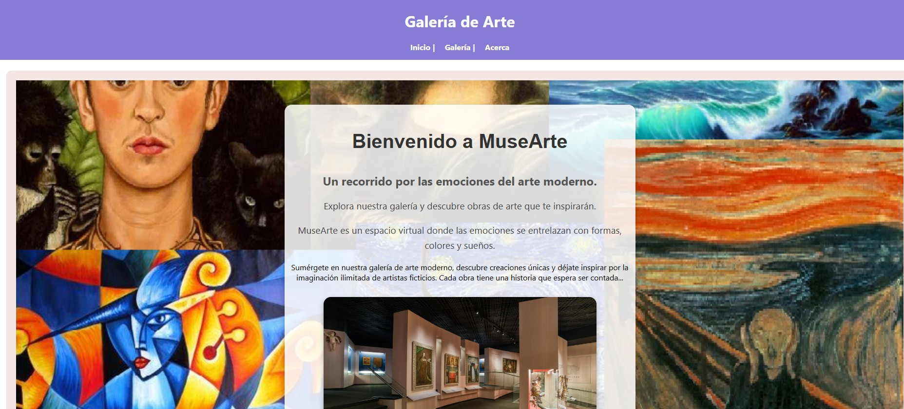

# MuseArte - Museo Virtual de Arte Moderno

MuseArte es una aplicación web construida con **Node.js**, **Express** y **Pug** que simula un museo virtual de arte moderno.  
El proyecto presenta una galería de obras ficticias, con detalles como título, autor, año y descripción.  
Fue desarrollado como parte de una práctica académica.

## Características

- Navegación entre secciones: Inicio, Galería y Detalle de Obra.
- Galería con 5 obras ficticias de arte moderno.
- Visualización de detalles individuales para cada obra.
- Middleware para registrar visitas y su hora.
- Preparado para despliegue en Vercel.

### 🌐 Subir el proyecto a GitHub

1. Si no has iniciado git:
   ```bash
   git init
   git add .
   git commit -m "Primer commit: MuseArte"
   ```

2. Crea un repositorio en GitHub (sin README ni `.gitignore`)

3. Conecta tu repositorio remoto:
   ```bash
   git remote add origin https://github.com/TU_USUARIO/musearte.git
   git push -u origin main
   ```

---

### 🚀 Desplegar en Vercel

1. Entra a [https://vercel.com](https://vercel.com) y crea un nuevo proyecto.
2. Elige el repositorio `musearte`.
3. Configura:
   - **Framework**: Other
   - **Build Command**: (vacío)
   - **Install Command**: `npm install`
   - **Output Directory**: (vacío)
4. Asegúrate de tener este archivo en tu raíz:
5. Haz clic en **Deploy** y espera unos segundos.
6. Vercel te dará un enlace como:
```
https://musearte.vercel.app
```

---

## 🛤️ Estructura del Proyecto

```
musearte/
├── index.js              # Entrada principal
├── routes/
│   └── main.js           # Rutas Express
├── views/                # Plantillas Pug
│   ├── layout.pug
│   ├── index.pug
│   ├── galeria.pug
│   ├── obra.pug
│   └── acerca.pug
├── public/               # Archivos estáticos
│   ├── css/style.css
│   └── img/
├── vercel.json           # Configuración de despliegue
└── README.md             # Este archivo
```

---

## 👨‍🎨 Autor

Proyecto creado por **Francy Paola Barrera Martinez**  
Materia: JavaScript - Práctica Parcial 2  
Universidad: [Nombre de tu institución]

---

## 📄 Licencia

Este proyecto es de uso académico y no comercial.  
Las imágenes utilizadas pertenecen a sus respectivos autores o fueron generadas para fines educativos.
